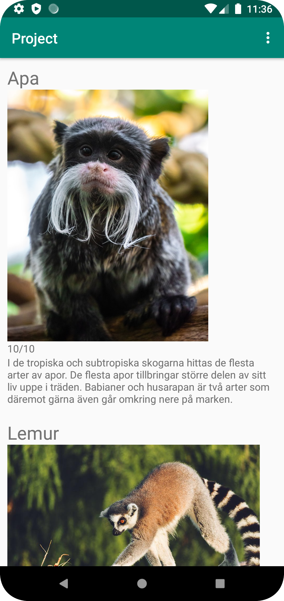
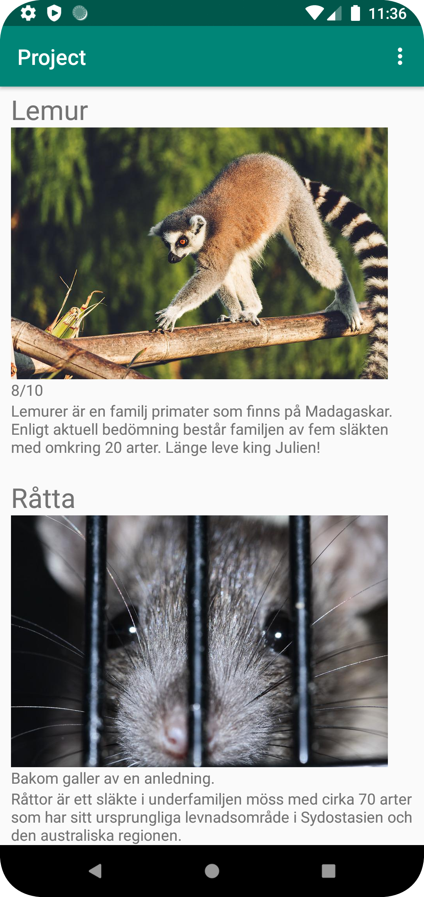
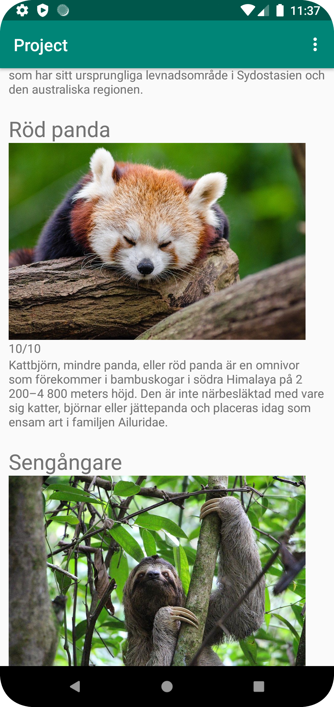
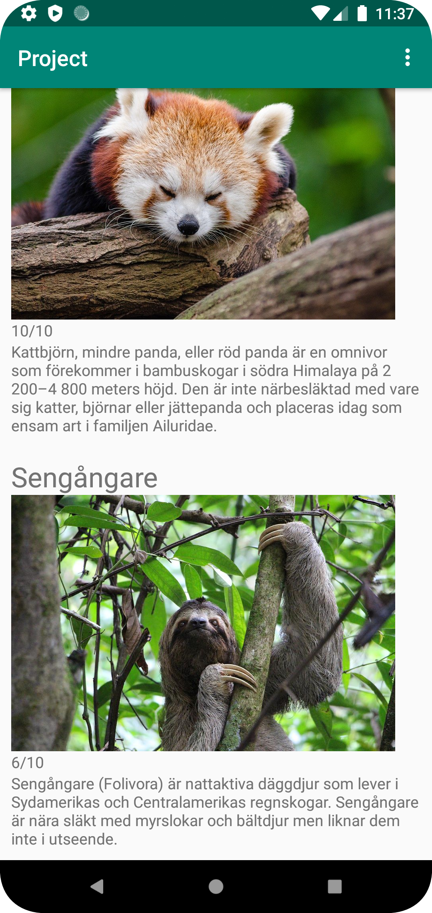
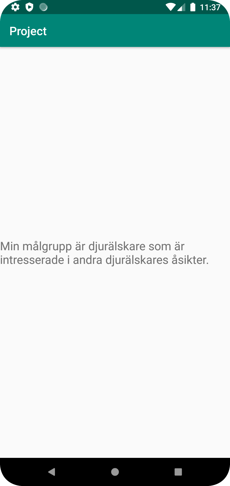

Projektet bestod av en egen konstruerad app vilket hämtar data från en json URL vilket har data som är egen gjord.
Detta ska displayas genom en recyclerView. Min app var om djur och hade även en målgruppsaktivitet.
En bild, namn på djuret, beskrivning och en skala skapadas för vaje djur.
Då projektet bestod av många element vilket sedan tidigare har både använts och beskrivits inom rapporter kommer bara unika delar av appens uppbyggnas beskrivas.

Importering av bilder skedde genom användningen av bibloteket picasso.

```
public class ImageDownloader extends AsyncTask<String, Void, Bitmap> {
    private ImageView image;

    public ImageDownloader(ImageView view) {
        this.image = view;
    }

    @Override
    protected Bitmap doInBackground(String... urls) {
        try {
            URL url = new URL(urls[0]);
            Bitmap bitmap = BitmapFactory.decodeStream(url.openConnection().getInputStream());
            return bitmap;
        } catch (IOException e) {
            e.printStackTrace();
        }
        return null;
    }

    @Override
    protected void onPostExecute(Bitmap bitmap) {
        image.setImageBitmap(bitmap);
    }
}
```

Användaren kunde komma till den andra aktiviteten genom optionsMenu vilket fanns i toolbaren.

```
@Override
    public boolean onCreateOptionsMenu(Menu menu) {
        getMenuInflater().inflate(R.menu.menu_main, menu);
        return true;
    }

    @Override
    public boolean onOptionsItemSelected(MenuItem item) {
        int id = item.getItemId();

        if (id == R.id.about) {
            Log.d("==>","Tar dig till about");
            showAbout();
            return true;
        }

        return super.onOptionsItemSelected(item);
    }

    public void showAbout(){
        Intent intent = new Intent(MainActivity.this, AboutActivity.class);

        startActivity(intent);
    }
```













